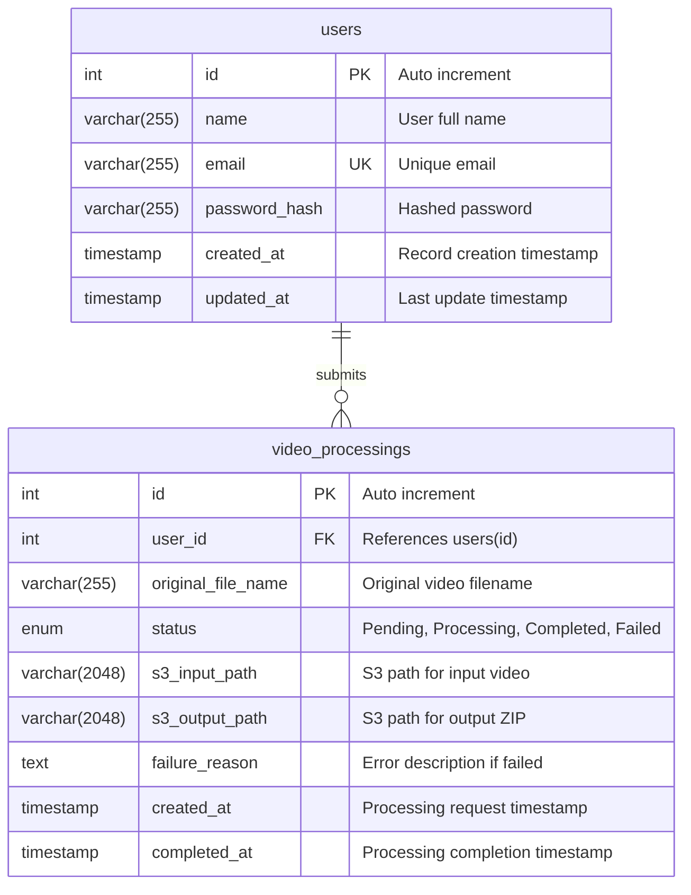
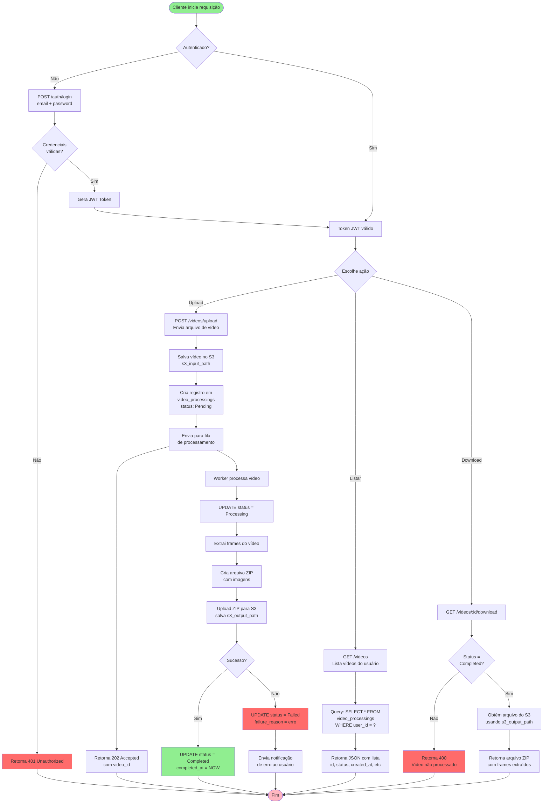

# FIAP Pós Tech - Arquitetura de Software - Hackathon 
Repositórios do projeto em grupo "Tech Challenge" (Grupo 11 da SOAT11 de 2025) do curso de [Arquitetura de Software da FIAP Pós Tech](https://postech.fiap.com.br/curso/software-architecture/).

## Projeto  

A empresa FIAP X precisa avançar no desenvolvimento de um projeto de processamento de imagens. Em uma rodada de investimentos, a empresa apresentou um projeto simples que processa um vídeo e retorna as imagens dele em um arquivo .zip. 
Os investidores gostaram tanto do projeto, que querem investir em uma versão onde eles possam enviar um vídeo e fazer download deste zip. 

O objetivo do projeto é aplicar os tópicos relacionados à arquitetura de software para atender os requistos propostos:

 - A nova versão do sistema deve processar mais de um vídeo ao mesmo tempo 
 - Em caso de picos, o sistema não deve perder uma requisição 
 - O Sistema deve ser protegido por usuário e senha 
 - O fluxo deve ter uma listagem de status dos vídeos de um usuário 
 - Em caso de erro, um usuário pode ser notificado (e-mail ou outro meio de comunicação)

## Arquitetura

### HLD High-Level Design

O diagrama de **High-Level Design (HLD)** apresenta uma visão arquitetural simplificada do sistema FIAP X hospedado na AWS. A arquitetura utiliza uma **Virtual Private Cloud (VPC)** para isolar os recursos de rede, garantindo segurança e controle sobre o tráfego.

**Componentes principais:**
- **API Gateway**: Atua como ponto de entrada único para todas as requisições HTTP vindas de clientes externos, gerenciando o tráfego e fornecendo uma camada de abstração
- **Amazon EKS (Elastic Kubernetes Service)**: Orquestra os containers da WebAPI, permitindo escalabilidade horizontal e alta disponibilidade para processar múltiplos vídeos simultaneamente
- **Amazon RDS MySQL**: Banco de dados relacional gerenciado que armazena informações de usuários, status de processamento de vídeos e metadados do sistema
- **Private Subnet**: Sub-rede privada que contém a WebAPI e o banco de dados, impedindo acesso direto da internet e aumentando a segurança da aplicação

O fluxo de dados segue o padrão: Cliente → API Gateway → EKS (WebAPI) → RDS MySQL, garantindo um processamento seguro e escalável das requisições.

### LLD Low-Level Design

O diagrama de **Low-Level Design (LLD)** detalha a implementação técnica da infraestrutura AWS, expandindo o HLD com especificações concretas de recursos e configurações.

**Componentes detalhados:**
- **API Gateway REST API**: Implementação específica usando o tipo REST API do AWS API Gateway, responsável pelo roteamento de requisições
- **Amazon EKS Cluster**: Ambiente Kubernetes gerenciado executando a aplicação WebAPI em containers, com suporte a auto-scaling para atender picos de demanda
- **RDS MySQL Instance**: 
  - Engine: MySQL 8.0
  - Classe de instância: db.t3.micro (otimizada para workloads de desenvolvimento)
  - Configuração adequada para armazenar dados de usuários e status de processamento
- **Amazon ECR (Elastic Container Registry)**: Repositório de imagens Docker contendo:
  - `fiapx-usuarios`: Imagem do microsserviço de gestão de usuários
  - `fiapx-videos`: Imagem do microsserviço de interação com o frontend para upload e download.
  - `fiapx-processamento`: Imagem do microsserviço de processamento de vídeos
- **VPC com CIDR 172.31.0.0/16**: Rede privada virtual isolada com endereçamento IP privado
- **Private Subnet**: Segmento de rede sem acesso direto à internet, protegendo recursos críticos

A arquitetura LLD demonstra uma implementação baseada em microsserviços, onde cada funcionalidade (usuários e vídeos) é containerizada separadamente, promovendo desacoplamento e facilitando manutenção e escalabilidade independente.

### Arquitetura do Software

O diagrama de **Arquitetura do Software (DAS)** ilustra a organização interna da aplicação seguindo os princípios de **Clean Architecture** e **Arquitetura Hexagonal (Ports and Adapters)**.

**Camadas da arquitetura:**

1. **WebAPI** (Camada de Apresentação - Azul):
   - Ponto de entrada da aplicação, expondo endpoints REST para comunicação com clientes
   - Recebe requisições HTTP e delega o processamento para camadas internas
   - Responsável pela serialização/desserialização de dados e validações de entrada

2. **Adapters** (Camada de Adaptadores - Verde):
   - Implementa os portos de entrada e saída da arquitetura hexagonal
   - Converte dados entre formatos externos e o domínio da aplicação
   - Isola a lógica de negócios de dependências externas (databases, APIs, etc.)

3. **Application** (Camada de Aplicação - Laranja):
   - Orquestra casos de uso e regras de negócio da aplicação
   - Implementa services e handlers que coordenam operações entre diferentes componentes
   - Gerencia transações e fluxos de trabalho complexos

4. **Domain** (Camada de Domínio - Amarelo):
   - Núcleo da aplicação contendo as entidades de negócio e regras de domínio puras
   - Independente de frameworks e tecnologias externas
   - Representa conceitos do negócio (Vídeo, Usuário, Status de Processamento, etc.)

5. **Datasource** (Camada de Infraestrutura de Dados - Azul):
   - Implementa a persistência de dados
   - Gerencia conexões com bancos de dados (MySQL, S3 para armazenamento de arquivos)
   - Implementa repositórios e data mappers

6. **MySQL Database**: Banco de dados relacional para armazenamento persistente

**Fluxo de dependências:**
O fluxo segue a regra de dependência da Clean Architecture: camadas externas dependem de camadas internas, mas nunca o contrário. O Domain é completamente independente, garantindo testabilidade e manutenibilidade.

### Arquitetura de Dados

O modelo de dados do sistema FIAP X é projetado para gerenciar usuários e o processamento de vídeos de forma eficiente e escalável. O banco de dados MySQL armazena informações essenciais para autenticação, rastreamento de processamento e armazenamento de metadados.

#### Modelo Entidade-Relacionamento

#### Descrição das Entidades

**Tabela `users`** - Gerenciamento de Usuários:
- Armazena informações de autenticação e identificação dos usuários do sistema
- **id**: Chave primária com auto-incremento para identificação única
- **name**: Nome completo do usuário
- **email**: Email único para login e notificações (constraint UNIQUE)
- **password_hash**: Senha criptografada usando algoritmos de hash seguros (bcrypt, Argon2, etc.)
- **created_at/updated_at**: Timestamps automáticos para auditoria de criação e modificação de registros

**Tabela `video_processings`** - Processamento de Vídeos:
- Rastreia cada requisição de processamento de vídeo com seu estado e resultados
- **id**: Chave primária com auto-incremento
- **user_id**: Chave estrangeira referenciando `users(id)` com `ON DELETE CASCADE` (quando um usuário é deletado, todos seus processamentos são removidos)
- **original_file_name**: Nome original do arquivo enviado pelo usuário
- **status**: Estado atual do processamento com 4 possíveis valores:
  - `Pending`: Aguardando processamento na fila
  - `Processing`: Sendo processado no momento
  - `Completed`: Processamento concluído com sucesso
  - `Failed`: Falha durante o processamento
- **s3_input_path**: Caminho completo no Amazon S3 onde o vídeo original foi armazenado
- **s3_output_path**: Caminho no S3 onde o arquivo ZIP com frames extraídos está armazenado (NULL até conclusão)
- **failure_reason**: Descrição detalhada do erro caso o status seja `Failed`
- **created_at**: Timestamp de quando a requisição foi criada
- **completed_at**: Timestamp de conclusão do processamento (NULL enquanto não finalizado)

#### Relacionamentos

- **users → video_processings**: Relacionamento **1:N** (um usuário pode submeter múltiplos processamentos)
- A integridade referencial é garantida pela constraint `FOREIGN KEY` com `ON DELETE CASCADE`
- Permite listagem de todos os vídeos de um usuário e rastreamento completo do histórico de processamento

#### Estratégia de Armazenamento

O modelo adota uma abordagem híbrida:
- **Metadados no MySQL**: Informações estruturadas para consultas rápidas e relacionamentos
- **Arquivos no Amazon S3**: Vídeos originais e ZIPs de saída armazenados em object storage escalável
- Paths do S3 armazenados como strings longas (VARCHAR 2048) para suportar estruturas de diretórios complexas

Esta arquitetura suporta os requisitos do projeto:
- ✅ Processamento múltiplo: Múltiplos registros `video_processings` com status independentes
- ✅ Proteção por usuário/senha: Tabela `users` com autenticação
- ✅ Listagem de status: Query por `user_id` para visualizar todos os processamentos
- ✅ Notificação de erros: Campo `failure_reason` armazena detalhes para envio de alertas

### Fluxo da informação

#### Descrição do Fluxo

**1. Autenticação:**
- Cliente tenta acessar o sistema
- Se não autenticado, realiza login com email/senha
- Sistema valida credenciais na tabela `users`
- Gera token JWT para autenticação subsequente

**2. Upload de Vídeo:**
- Cliente envia vídeo via POST /videos/upload
- Sistema salva arquivo no S3 (s3_input_path)
- Cria registro em `video_processings` com status `Pending`
- Adiciona job na fila de processamento
- Retorna imediatamente com HTTP 202 (requisição aceita mas não processada)

**3. Processamento Assíncrono:**
- Worker retira job da fila
- Atualiza status para `Processing`
- Extrai frames do vídeo
- Cria arquivo ZIP com as imagens
- Faz upload do ZIP para S3 (s3_output_path)
- Atualiza status para `Completed` ou `Failed`
- Em caso de falha, envia notificação ao usuário

**4. Listagem de Status:**
- Cliente consulta GET /videos
- Sistema busca todos os registros do usuário em `video_processings`
- Retorna lista com status atual de cada processamento

**5. Download do Resultado:**
- Cliente solicita GET /videos/:id/download
- Sistema verifica se status = `Completed`
- Se sim, busca arquivo ZIP do S3 e retorna
- Se não, retorna erro 400 informando que processamento não finalizou

Este fluxo garante processamento assíncrono de múltiplos vídeos, tolerância a picos de demanda via fila, e rastreamento completo do status de cada processamento.

