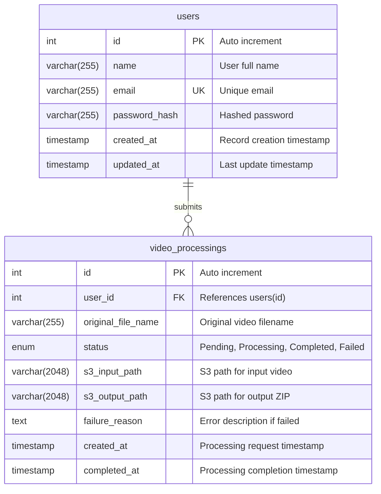

# Diagrama de Banco de Dados - FIAP X

```mermaid
erDiagram
    users ||--o{ video_processings : "submits"
    
    users {
        int id PK "Auto increment"
        varchar(255) name "User full name"
        varchar(255) email UK "Unique email"
        varchar(255) password_hash "Hashed password"
        timestamp created_at "Record creation timestamp"
        timestamp updated_at "Last update timestamp"
    }
    
    video_processings {
        int id PK "Auto increment"
        int user_id FK "References users(id)"
        varchar(255) original_file_name "Original video filename"
        enum status "Pending, Processing, Completed, Failed"
        varchar(2048) s3_input_path "S3 path for input video"
        varchar(2048) s3_output_path "S3 path for output ZIP"
        text failure_reason "Error description if failed"
        timestamp created_at "Processing request timestamp"
        timestamp completed_at "Processing completion timestamp"
    }
```
